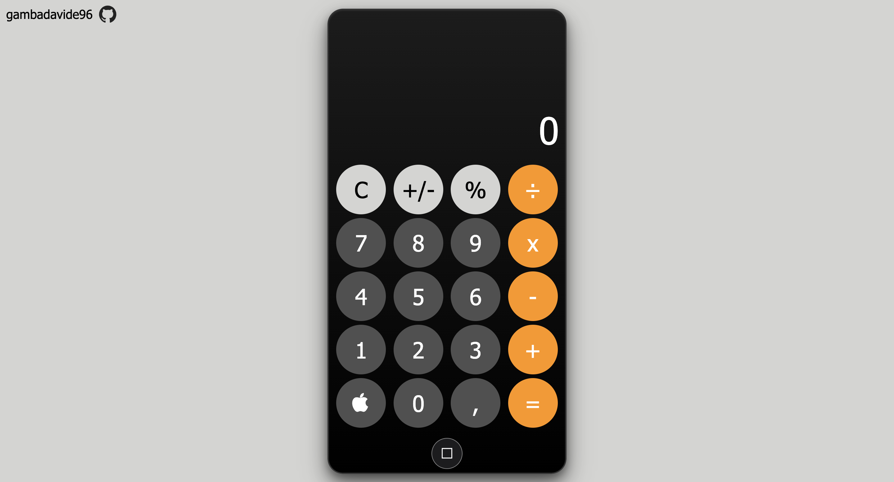

# iOS-Style Calculator 📱

An on-screen calculator built using **JavaScript**, **HTML**, and **CSS**, designed to mimic the clean and minimal look of the iOS calculator app.
This project focuses on practices with HTML, CSS and Javascript.
It was developed as part of **[The Odin Project](https://www.theodinproject.com/)** curriculum.

👉 **[Try here](https://gambadavide96.github.io/calculator/)**.

## ✨ Features

* **iOS-like design** for a familiar and modern look.
* **Basic arithmetic operations**: addition, subtraction, multiplication, division and percentage.
* **Clear function**: in order to restart and insert a new operand.  

## 🛠️ Technologies Used

* **HTML5** – Structure and layout
* **CSS3** – Styling, flex layout, and animations
* **JavaScript (ES6)** – Calculator logic and event handling

## 📌 Future Improvements

* Support for advanced operations
* Keyboard input support
* Delete functions

## 📸 Screenshot

## 🙏 Acknowledgments

A special thanks to **The Odin Project** team and community for providing an excellent learning path and valuable resources.

